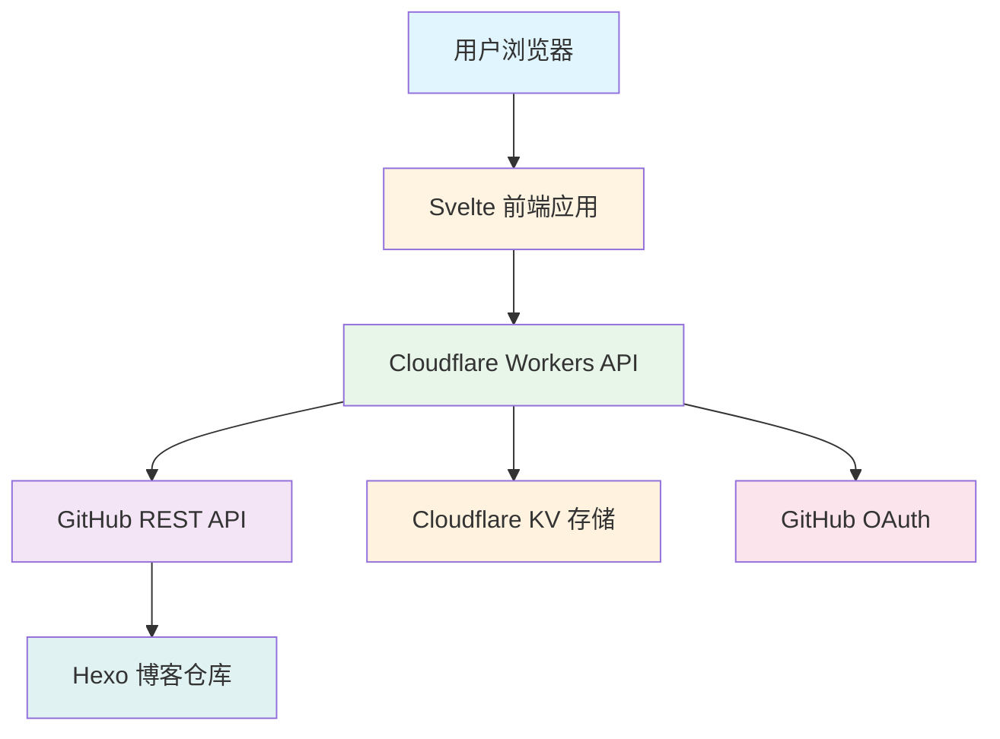
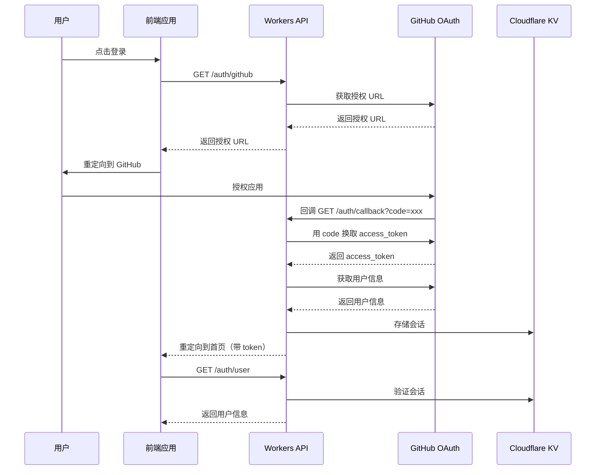
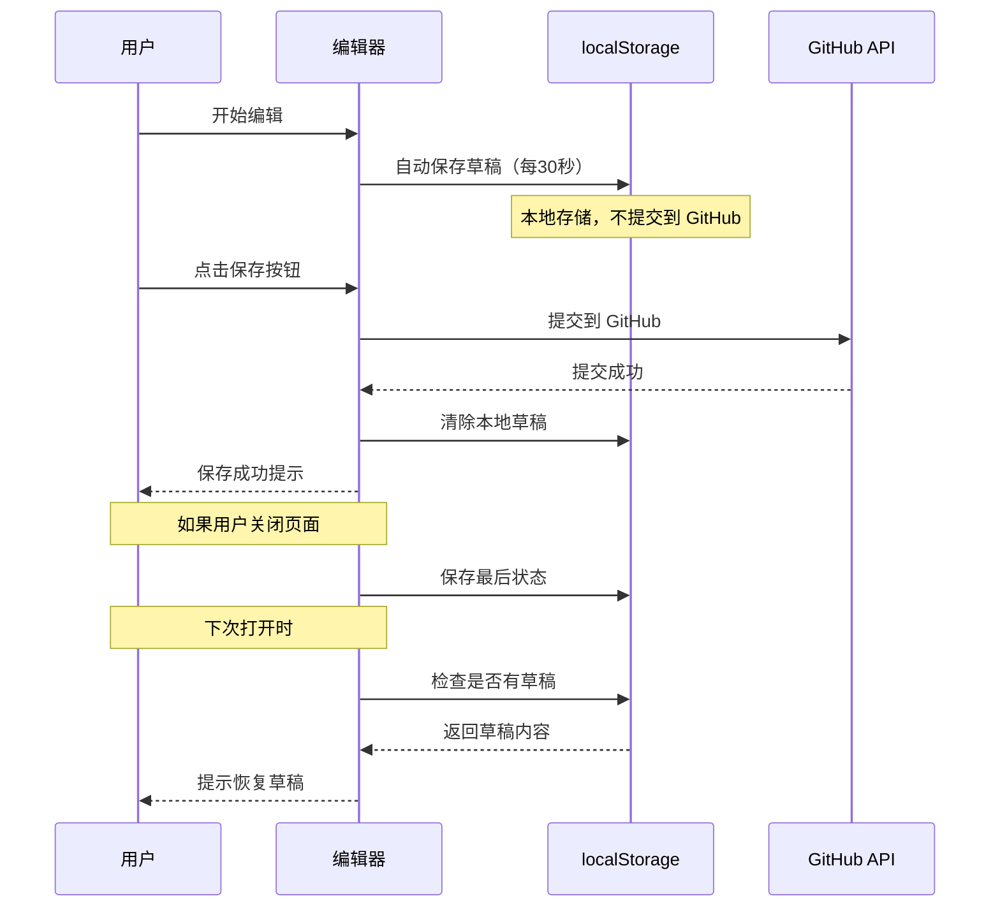

# Hexo 博客管理工具 - 技术方案

## 项目概述

创建一个基于 Cloudflare Workers 的 Hexo 博客管理工具，通过 GitHub API 进行仓库操作，提供移动友好的 Web 界面，支持文章的创建、编辑、删除和预览功能。

## 技术栈

### 后端
- **运行时**: Cloudflare Workers (Edge Computing)
- **语言**: TypeScript
- **API 交互**: GitHub REST API (使用 GitHub Explorer Framework)
- **认证**: GitHub OAuth 2.0
- **存储**: Cloudflare KV (用于存储用户会话和配置)

### 前端
- **框架**: Svelte 5
- **UI 组件库**: Skeleton UI
- **Markdown 编辑器**: CodeMirror 6
- **Markdown 预览**: marked.js
- **状态管理**: Svelte stores
- **HTTP 客户端**: fetch API

## 系统架构



## 核心功能模块

### 1. 认证模块
- GitHub OAuth 2.0 登录流程
- 用户会话管理
- Token 存储和刷新

### 2. 文章管理模块
- 文章列表查询（支持分页、搜索）
- 创建文章（自动生成 Hexo front-matter）
- 编辑文章
- 删除文章
- 获取文章详情

### 3. Markdown 编辑器模块
- 实时 Markdown 编辑
- 语法高亮
- 实时预览
- 自动保存

### 4. Hexo 优化模块
- 自动生成 front-matter（title, date）
- 文件名格式化（title.md）
- 路径管理（默认 `_posts` 目录）

## API 设计

### 认证相关
```
GET  /auth/github          - 获取 GitHub OAuth 授权 URL
GET  /auth/callback        - OAuth 回调处理
GET  /auth/user            - 获取当前用户信息
POST /auth/logout          - 登出
```

### 文章管理
```
GET    /api/posts          - 获取文章列表
GET    /api/posts/:path    - 获取文章详情
POST   /api/posts          - 创建新文章
PUT    /api/posts/:path    - 更新文章
DELETE /api/posts/:path    - 删除文章
```

### 仓库管理
```
GET /api/repo              - 获取仓库信息
GET /api/repo/branches     - 获取分支列表
```

## 数据模型

### 文章数据结构
```typescript
interface Post {
  path: string;           // 文件路径，如 _posts/hello-world.md
  name: string;           // 文件名
  sha: string;            // Git SHA
  size: number;           // 文件大小
  url: string;            // 文件 URL
  content?: string;       // 文件内容（Base64）
  frontMatter?: {
    title: string;
    date: string;
  };
}
```

### 用户会话数据结构
```typescript
interface UserSession {
  accessToken: string;
  refreshToken?: string;
  user: {
    id: number;
    login: string;
    avatar_url: string;
  };
  repo?: {
    owner: string;
    name: string;
  };
  expiresAt: number;
}
```

## 项目结构

```
blogwriter/
├── wrangler.toml              # Cloudflare Workers 配置
├── package.json               # 项目依赖
├── tsconfig.json              # TypeScript 配置
├── vite.config.ts             # Vite 配置
│
├── src/
│   ├── worker/                # Cloudflare Workers 后端
│   │   ├── index.ts           # Worker 入口
│   │   ├── auth.ts            # 认证逻辑
│   │   ├── github.ts          # GitHub API 封装
│   │   ├── posts.ts           # 文章管理逻辑
│   │   └── types.ts           # 类型定义
│   │
│   ├── app/                   # Svelte 前端应用
│   │   ├── App.svelte         # 主应用组件
│   │   ├── main.ts            # 前端入口
│   │   │
│   │   ├── components/        # UI 组件
│   │   │   ├── Header.svelte
│   │   │   ├── PostList.svelte
│   │   │   ├── PostEditor.svelte
│   │   │   ├── MarkdownEditor.svelte
│   │   │   ├── PreviewPane.svelte
│   │   │   └── LoginButton.svelte
│   │   │
│   │   ├── stores/            # Svelte stores
│   │   │   ├── auth.ts        # 认证状态
│   │   │   ├── posts.ts       # 文章状态
│   │   │   └── editor.ts      # 编辑器状态
│   │   │
│   │   ├── lib/               # 工具函数
│   │   │   ├── api.ts         # API 客户端
│   │   │   ├── hexo.ts        # Hexo 工具函数
│   │   │   └── utils.ts       # 通用工具
│   │   │
│   │   └── routes/            # 路由页面
│   │       ├── +layout.svelte
│   │       ├── +page.svelte   # 首页（文章列表）
│   │       ├── post/
│   │       │   └── [slug]/+page.svelte
│   │       └── settings/+page.svelte
│   │
│   └── shared/                # 前后端共享代码
│       └── types.ts           # 共享类型定义
│
├── static/                    # 静态资源
│   └── favicon.ico
│
├── docs/                      # 文档
│   ├── DEPLOYMENT.md          # 部署指南
│   └── USAGE.md               # 使用说明
│
└── README.md                  # 项目说明
```

## 关键技术实现

### GitHub OAuth 认证流程



### Hexo Front-Matter 生成

新建文章时自动生成以下格式：

```yaml
---
title: 文章标题
date: 2024-01-15 10:30:00
---
```

文件名格式：`title.md`

### Markdown 编辑器功能

- 使用 CodeMirror 6 作为编辑器核心
- 支持 Markdown 语法高亮
- 实时预览（使用 marked.js）
- 自动保存到本地（防抖，每 30 秒或失去焦点时保存到浏览器 localStorage）
- 手动保存到 GitHub（点击保存按钮或 Ctrl/Cmd + S 快捷键）
- 离线编辑支持（从 localStorage 恢复未保存的内容）

### 自动保存策略详解

**本地自动保存（自动）**
- 触发时机：编辑器内容变化后 30 秒，或编辑器失去焦点时
- 保存位置：浏览器 localStorage
- 保存内容：文章标题、内容、编辑状态
- 目的：防止意外关闭导致内容丢失

**GitHub 提交（手动）**
- 触发时机：用户点击"保存"按钮或按 Ctrl/Cmd + S
- 操作：通过 GitHub API 创建或更新文件，并提交到仓库
- Commit 消息：`Update: [文章标题]` 或 `Create: [文章标题]`
- 目的：将更改持久化到 GitHub 仓库

**恢复机制**
- 打开编辑器时，检查 localStorage 是否有未保存的草稿
- 如果存在，提示用户是否恢复
- 用户可以选择恢复草稿或重新从 GitHub 加载



## 部署架构

### Cloudflare Workers 配置

```toml
# wrangler.toml
name = "hexo-blog-manager"
main = "src/worker/index.ts"
compatibility_date = "2024-01-01"

[site]
bucket = "./dist"

[[kv_namespaces]]
binding = "SESSIONS"
id = "your-kv-namespace-id"

[vars]
GITHUB_CLIENT_ID = "your-client-id"
GITHUB_REDIRECT_URI = "https://your-domain.workers.dev/auth/callback"
```

### 环境变量

- `GITHUB_CLIENT_ID`: GitHub OAuth App Client ID
- `GITHUB_CLIENT_SECRET`: GitHub OAuth App Client Secret
- `GITHUB_REDIRECT_URI`: OAuth 回调 URL
- `SESSION_KV_ID`: KV Namespace ID

## 安全考虑

1. **CSRF 保护**: 使用 state 参数防止 CSRF 攻击
2. **Token 安全**: Access Token 存储在 KV 中，仅返回短期 token 给前端
3. **HTTPS 强制**: Cloudflare Workers 自动提供 HTTPS
4. **输入验证**: 验证所有用户输入，防止注入攻击
5. **速率限制**: 实施合理的 API 调用限制

## 性能优化

1. **边缘计算**: Cloudflare Workers 在全球边缘节点运行
2. **缓存策略**: 利用 Cloudflare CDN 缓存静态资源
3. **KV 缓存**: 缓存用户会话和常用数据
4. **代码分割**: Svelte 自动进行代码分割
5. **懒加载**: 按需加载组件和库

## 移动端优化

1. **响应式设计**: 使用 Skeleton UI 的响应式组件
2. **触摸友好**: 优化按钮和交互区域的点击区域
3. **离线支持**: 考虑使用 Service Worker 支持离线编辑
4. **性能优化**: 减少初始加载体积

## 开发和部署流程

### 开发环境
```bash
# 安装依赖
npm install

# 启动开发服务器
npm run dev

# 类型检查
npm run type-check

# 构建
npm run build
```

### 部署流程
```bash
# 登录 Cloudflare
npx wrangler login

# 创建 KV Namespace
npx wrangler kv:namespace create SESSIONS

# 更新 wrangler.toml 中的 KV ID

# 部署到 Cloudflare Workers（API 服务）
wrangler deploy

# 构建前端
npm run build

# 部署到 Cloudflare Pages（前端）
npm run deploy:pages
```

### 快速部署
使用项目提供的部署脚本一键完成所有部署步骤：
```bash
bash builddeploy.sh
```

## 后续扩展功能

1. **图片上传**: 支持上传图片到仓库或图床
2. **标签/分类管理**: 管理文章的标签和分类
3. **草稿箱**: 保存未发布的草稿
4. **发布管理**: 控制文章的发布状态
5. **主题编辑**: 编辑 Hexo 配置和主题文件
6. **多仓库支持**: 管理多个博客仓库
7. **协作功能**: 支持多人协作编辑

## 技术选型理由

### Cloudflare Workers
- 全球边缘节点，低延迟
- 无服务器架构，无需管理基础设施
- 免费额度充足
- 原生支持 TypeScript

### Svelte + Skeleton
- Svelte 编译时优化，运行时性能优异
- Skeleton UI 提供现代、美观的组件
- 代码简洁，易于维护
- 良好的移动端支持

### GitHub REST API
- 官方 API，稳定可靠
- 完整的仓库操作能力
- 良好的文档和社区支持

## 风险和挑战

1. **GitHub API 限制**: 需要合理处理速率限制
2. **文件大小限制**: Workers 有请求体大小限制
3. **会话管理**: KV 存储有 TTL 限制
4. **离线编辑**: 完整的离线支持需要额外工作

## 总结

本方案提供了一个完整的 Hexo 博客管理工具设计，使用现代化的技术栈，专注于移动端体验，通过 Cloudflare Workers 实现全球低延迟访问。系统架构清晰，模块化设计便于扩展和维护。
