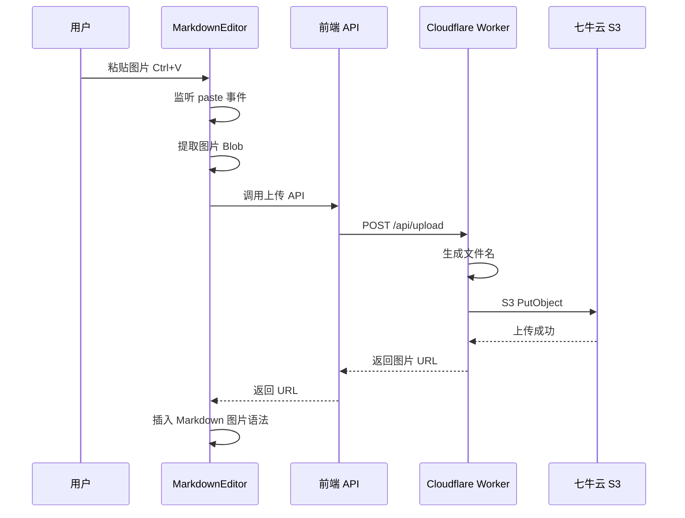

# 图片粘贴上传功能设计方案

## 需求概述

在 Markdown 编辑器中支持粘贴图片自动上传到七牛云（使用 S3 兼容 API），并自动插入 Markdown 图片链接。

### 核心需求
- 用户在设置页面配置七牛云 S3 信息
- 在编辑器中粘贴图片时自动上传
- 上传成功后自动插入 Markdown 图片语法
- 支持配置存储路径前缀（如 `/blog/`）
- 文件命名：时间戳 + 随机字符串

## 技术架构



## 数据结构设计

### 七牛云 S3 配置类型

```typescript
// src/shared/types.ts 新增

// 七牛云 S3 配置
export interface QiniuS3Config {
  endpoint: string;      // S3 endpoint，如 s3-cn-south-1.qiniucs.com
  region: string;        // 区域，如 cn-south-1
  accessKeyId: string;   // Access Key
  secretAccessKey: string; // Secret Key
  bucket: string;        // 存储空间名称
  domain: string;        // CDN 域名，如 https://cdn.example.com
  pathPrefix: string;    // 路径前缀，如 blog/images
}

// 图片上传请求参数
export interface ImageUploadParams {
  imageData: string;     // Base64 编码的图片数据
  mimeType: string;      // MIME 类型，如 image/png
  config: QiniuS3Config; // 七牛云配置
}

// 图片上传响应
export interface ImageUploadResponse {
  url: string;           // 图片访问 URL
  key: string;           // 存储 key
}
```

## 模块设计

### 1. 设置页面 - 七牛云配置表单

**文件**: [`src/app/routes/settings/+page.svelte`](src/app/routes/settings/+page.svelte)

新增配置项：
- S3 Endpoint（下拉选择或自定义）
- Region（根据 Endpoint 自动填充）
- Access Key ID
- Secret Access Key（密码输入框）
- Bucket 名称
- CDN 域名
- 路径前缀

配置存储在 localStorage，key 为 `qiniuS3Config`。

### 2. 前端 API 函数

**文件**: [`src/app/lib/api.ts`](src/app/lib/api.ts)

```typescript
// 新增图片上传 API
export const imageApi = {
  // 上传图片到七牛云
  async upload(params: ImageUploadParams): Promise<ApiResponse<ImageUploadResponse>> {
    return request<ImageUploadResponse>('/api/upload', {
      method: 'POST',
      body: JSON.stringify(params),
    });
  },
};
```

### 3. Worker 端上传处理

**新文件**: `src/worker/upload.ts`

```typescript
import { Env } from './index';

// 生成唯一文件名
function generateFileName(mimeType: string): string {
  const timestamp = Date.now();
  const random = Math.random().toString(36).substring(2, 10);
  const ext = mimeType.split('/')[1] || 'png';
  return `${timestamp}-${random}.${ext}`;
}

// 计算 AWS Signature V4
async function signRequest(
  method: string,
  url: URL,
  headers: Headers,
  body: ArrayBuffer,
  config: QiniuS3Config
): Promise<Headers> {
  // 实现 AWS Signature V4 签名算法
  // ...
}

export async function handleUpload(
  request: Request,
  env: Env,
  ctx: ExecutionContext,
  corsHeaders: Record<string, string>
): Promise<Response> {
  // 1. 解析请求体
  // 2. 验证配置
  // 3. 生成文件名
  // 4. 构建 S3 请求
  // 5. 签名并发送
  // 6. 返回结果
}
```

### 4. MarkdownEditor 组件修改

**文件**: [`src/app/components/MarkdownEditor.svelte`](src/app/components/MarkdownEditor.svelte)

新增功能：
- 监听 paste 事件
- 检测粘贴内容是否包含图片
- 显示上传进度提示
- 上传成功后在光标位置插入 Markdown 图片语法

```typescript
// 粘贴事件处理
function handlePaste(event: ClipboardEvent) {
  const items = event.clipboardData?.items;
  if (!items) return;

  for (const item of items) {
    if (item.type.startsWith('image/')) {
      event.preventDefault();
      const blob = item.getAsFile();
      if (blob) {
        uploadImage(blob);
      }
      break;
    }
  }
}

// 上传图片
async function uploadImage(blob: Blob) {
  // 1. 显示上传中提示
  // 2. 转换为 Base64
  // 3. 调用上传 API
  // 4. 插入 Markdown 图片语法
  // 5. 隐藏提示
}
```

## 七牛云 S3 区域对照表

| 区域 | Region | Endpoint |
|------|--------|----------|
| 华东-浙江 | cn-east-1 | s3-cn-east-1.qiniucs.com |
| 华东-浙江2 | cn-east-2 | s3-cn-east-2.qiniucs.com |
| 华北-河北 | cn-north-1 | s3-cn-north-1.qiniucs.com |
| 华南-广东 | cn-south-1 | s3-cn-south-1.qiniucs.com |
| 北美-洛杉矶 | us-north-1 | s3-us-north-1.qiniucs.com |
| 亚太-新加坡 | ap-southeast-1 | s3-ap-southeast-1.qiniucs.com |

## 文件变更清单

### 新增文件
1. `src/worker/upload.ts` - Worker 端图片上传处理

### 修改文件
1. `src/shared/types.ts` - 添加七牛云配置和上传相关类型
2. `src/app/lib/api.ts` - 添加图片上传 API 函数
3. `src/app/routes/settings/+page.svelte` - 添加七牛云配置表单
4. `src/app/components/MarkdownEditor.svelte` - 添加粘贴图片上传功能
5. `src/worker/index.ts` - 添加上传路由
6. `src/app/stores/auth.ts` - 添加七牛云配置存储方法

## 安全考虑

1. **敏感信息存储**: Secret Access Key 存储在用户本地 localStorage，不会上传到服务器
2. **请求签名**: 在 Worker 端进行 S3 签名，避免在前端暴露密钥
3. **文件类型验证**: 只允许上传图片类型（image/*）
4. **文件大小限制**: 建议限制单个图片最大 10MB

## 用户体验

1. **上传状态提示**: 在编辑器中显示上传进度
2. **错误处理**: 上传失败时显示友好的错误提示
3. **配置验证**: 保存配置前验证连接是否正常
4. **快捷操作**: 支持拖拽上传（可选扩展）

## 实施步骤

1. 添加类型定义
2. 实现设置页面配置表单
3. 实现 Worker 端上传逻辑（包含 S3 签名）
4. 实现前端 API 调用
5. 修改编辑器组件支持粘贴上传
6. 添加上传状态提示
7. 测试和调试
