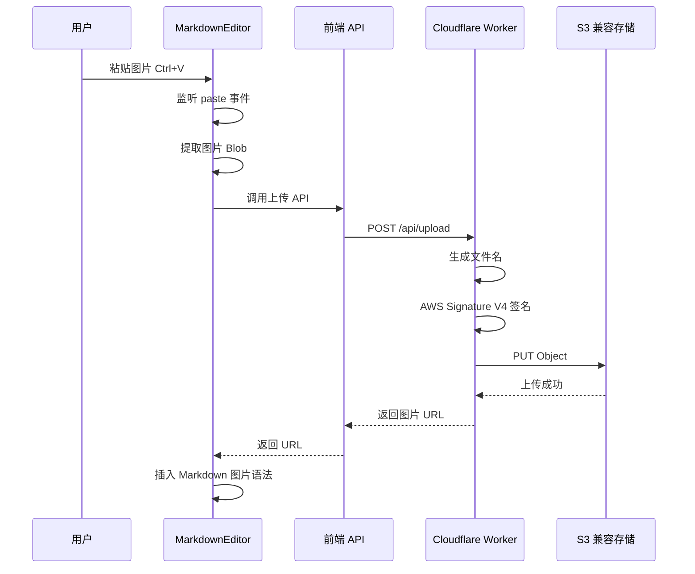

# 图片粘贴上传功能设计方案（通用 S3 兼容）

## 需求概述

在 Markdown 编辑器中支持粘贴图片自动上传到任意 S3 兼容存储服务，并自动插入 Markdown 图片链接。

### 支持的存储服务
- **AWS S3**
- **阿里云 OSS**（S3 兼容模式）
- **腾讯云 COS**（S3 兼容模式）
- **七牛云 Kodo**（S3 兼容模式）
- **Cloudflare R2**
- **MinIO**
- **其他 S3 兼容存储**

### 核心需求
- 用户在设置页面配置 S3 信息
- 在编辑器中粘贴图片时自动上传
- 上传成功后自动插入 Markdown 图片语法
- 支持配置存储路径前缀（如 `blog/images/`）
- 文件命名：时间戳 + 随机字符串

## 技术架构



## 数据结构设计

### S3 配置类型

```typescript
// src/shared/types.ts 新增

// S3 兼容存储配置
export interface S3Config {
  provider: string;           // 服务商标识：aws, aliyun, tencent, qiniu, r2, minio, custom
  endpoint: string;           // S3 endpoint URL
  region: string;             // 区域
  accessKeyId: string;        // Access Key ID
  secretAccessKey: string;    // Secret Access Key
  bucket: string;             // 存储桶名称
  publicUrl: string;          // 公开访问 URL 前缀（CDN 域名）
  pathPrefix: string;         // 路径前缀，如 blog/images
  forcePathStyle: boolean;    // 是否使用路径风格（MinIO 等需要）
}

// 预设服务商配置
export interface S3ProviderPreset {
  name: string;               // 显示名称
  regions: Array<{
    id: string;
    name: string;
    endpoint: string;
  }>;
  forcePathStyle: boolean;
}

// 图片上传请求参数
export interface ImageUploadParams {
  imageData: string;          // Base64 编码的图片数据
  mimeType: string;           // MIME 类型，如 image/png
  config: S3Config;           // S3 配置
}

// 图片上传响应
export interface ImageUploadResponse {
  url: string;                // 图片访问 URL
  key: string;                // 存储 key
}
```

## 预设服务商配置

```typescript
// src/app/lib/s3-presets.ts

export const S3_PROVIDERS: Record<string, S3ProviderPreset> = {
  aws: {
    name: 'AWS S3',
    regions: [
      { id: 'us-east-1', name: '美国东部 N. Virginia', endpoint: 's3.us-east-1.amazonaws.com' },
      { id: 'us-west-2', name: '美国西部 Oregon', endpoint: 's3.us-west-2.amazonaws.com' },
      { id: 'ap-northeast-1', name: '亚太 东京', endpoint: 's3.ap-northeast-1.amazonaws.com' },
      { id: 'ap-southeast-1', name: '亚太 新加坡', endpoint: 's3.ap-southeast-1.amazonaws.com' },
      { id: 'eu-west-1', name: '欧洲 爱尔兰', endpoint: 's3.eu-west-1.amazonaws.com' },
    ],
    forcePathStyle: false,
  },
  aliyun: {
    name: '阿里云 OSS',
    regions: [
      { id: 'oss-cn-hangzhou', name: '华东1 杭州', endpoint: 'oss-cn-hangzhou.aliyuncs.com' },
      { id: 'oss-cn-shanghai', name: '华东2 上海', endpoint: 'oss-cn-shanghai.aliyuncs.com' },
      { id: 'oss-cn-beijing', name: '华北2 北京', endpoint: 'oss-cn-beijing.aliyuncs.com' },
      { id: 'oss-cn-shenzhen', name: '华南1 深圳', endpoint: 'oss-cn-shenzhen.aliyuncs.com' },
      { id: 'oss-cn-hongkong', name: '香港', endpoint: 'oss-cn-hongkong.aliyuncs.com' },
    ],
    forcePathStyle: false,
  },
  tencent: {
    name: '腾讯云 COS',
    regions: [
      { id: 'ap-beijing', name: '北京', endpoint: 'cos.ap-beijing.myqcloud.com' },
      { id: 'ap-shanghai', name: '上海', endpoint: 'cos.ap-shanghai.myqcloud.com' },
      { id: 'ap-guangzhou', name: '广州', endpoint: 'cos.ap-guangzhou.myqcloud.com' },
      { id: 'ap-chengdu', name: '成都', endpoint: 'cos.ap-chengdu.myqcloud.com' },
      { id: 'ap-hongkong', name: '香港', endpoint: 'cos.ap-hongkong.myqcloud.com' },
    ],
    forcePathStyle: false,
  },
  qiniu: {
    name: '七牛云 Kodo',
    regions: [
      { id: 'cn-east-1', name: '华东-浙江', endpoint: 's3-cn-east-1.qiniucs.com' },
      { id: 'cn-east-2', name: '华东-浙江2', endpoint: 's3-cn-east-2.qiniucs.com' },
      { id: 'cn-north-1', name: '华北-河北', endpoint: 's3-cn-north-1.qiniucs.com' },
      { id: 'cn-south-1', name: '华南-广东', endpoint: 's3-cn-south-1.qiniucs.com' },
      { id: 'us-north-1', name: '北美-洛杉矶', endpoint: 's3-us-north-1.qiniucs.com' },
      { id: 'ap-southeast-1', name: '亚太-新加坡', endpoint: 's3-ap-southeast-1.qiniucs.com' },
    ],
    forcePathStyle: false,
  },
  r2: {
    name: 'Cloudflare R2',
    regions: [
      { id: 'auto', name: '自动', endpoint: '' }, // 需要用户填写 account ID
    ],
    forcePathStyle: true,
  },
  minio: {
    name: 'MinIO',
    regions: [
      { id: 'custom', name: '自定义', endpoint: '' },
    ],
    forcePathStyle: true,
  },
  custom: {
    name: '自定义 S3 兼容',
    regions: [
      { id: 'custom', name: '自定义', endpoint: '' },
    ],
    forcePathStyle: false,
  },
};
```

## 模块设计

### 1. 设置页面 - S3 配置表单

**文件**: [`src/app/routes/settings/+page.svelte`](src/app/routes/settings/+page.svelte)

配置项：
- **服务商选择**: 下拉选择（AWS、阿里云、腾讯云、七牛云、R2、MinIO、自定义）
- **区域选择**: 根据服务商动态显示区域列表
- **Endpoint**: 自动填充或手动输入
- **Access Key ID**: 文本输入
- **Secret Access Key**: 密码输入框
- **Bucket 名称**: 文本输入
- **公开访问 URL**: CDN 域名或存储桶公开 URL
- **路径前缀**: 如 `blog/images`
- **路径风格**: 复选框（MinIO 等需要勾选）

配置存储在 localStorage，key 为 `s3Config`。

### 2. 前端 API 函数

**文件**: [`src/app/lib/api.ts`](src/app/lib/api.ts)

```typescript
// 新增图片上传 API
export const imageApi = {
  // 上传图片到 S3 兼容存储
  async upload(params: ImageUploadParams): Promise<ApiResponse<ImageUploadResponse>> {
    return request<ImageUploadResponse>('/api/upload', {
      method: 'POST',
      body: JSON.stringify(params),
    });
  },
};
```

### 3. Worker 端上传处理

**新文件**: `src/worker/upload.ts`

核心功能：
- 解析请求参数
- 生成唯一文件名（时间戳 + 随机字符串）
- 实现 AWS Signature V4 签名算法
- 发送 PUT 请求到 S3
- 返回图片访问 URL

```typescript
// 生成唯一文件名
function generateFileName(mimeType: string, pathPrefix: string): string {
  const timestamp = Date.now();
  const random = Math.random().toString(36).substring(2, 10);
  const ext = mimeType.split('/')[1] || 'png';
  const prefix = pathPrefix ? `${pathPrefix.replace(/\/$/, '')}/` : '';
  return `${prefix}${timestamp}-${random}.${ext}`;
}

// AWS Signature V4 签名
async function signRequest(
  method: string,
  url: URL,
  headers: Headers,
  body: ArrayBuffer,
  config: S3Config
): Promise<Headers> {
  // 实现标准 AWS Signature V4 签名算法
  // 支持所有 S3 兼容服务
}
```

### 4. MarkdownEditor 组件修改

**文件**: [`src/app/components/MarkdownEditor.svelte`](src/app/components/MarkdownEditor.svelte)

新增功能：
- 监听 paste 事件
- 检测粘贴内容是否包含图片
- 显示上传进度提示
- 上传成功后在光标位置插入 Markdown 图片语法

```svelte
<script lang="ts">
  // 新增 props
  export let onImageUpload: ((file: Blob) => Promise<string | null>) | undefined = undefined;

  // 粘贴事件处理
  function handlePaste(event: ClipboardEvent) {
    const items = event.clipboardData?.items;
    if (!items || !onImageUpload) return;

    for (const item of items) {
      if (item.type.startsWith('image/')) {
        event.preventDefault();
        const blob = item.getAsFile();
        if (blob) {
          uploadAndInsert(blob);
        }
        break;
      }
    }
  }

  // 上传并插入
  async function uploadAndInsert(blob: Blob) {
    // 1. 在光标位置插入占位符
    const placeholder = '';
    insertText(placeholder);
    
    // 2. 上传图片
    const url = await onImageUpload(blob);
    
    // 3. 替换占位符
    if (url) {
      replaceText(placeholder, ``);
    } else {
      replaceText(placeholder, '');
    }
  }
</script>
```

## 文件变更清单

### 新增文件
1. `src/worker/upload.ts` - Worker 端图片上传处理（含 AWS Signature V4）
2. `src/app/lib/s3-presets.ts` - S3 服务商预设配置

### 修改文件
1. `src/shared/types.ts` - 添加 S3 配置和上传相关类型
2. `src/app/lib/api.ts` - 添加图片上传 API 函数
3. `src/app/routes/settings/+page.svelte` - 添加 S3 配置表单
4. `src/app/components/MarkdownEditor.svelte` - 添加粘贴图片上传功能
5. `src/worker/index.ts` - 添加上传路由
6. `src/app/stores/auth.ts` - 添加 S3 配置存储方法
7. `src/app/routes/new/+page.svelte` - 传递图片上传回调
8. `src/app/routes/edit/[slug]/+page.svelte` - 传递图片上传回调

## 安全考虑

1. **敏感信息存储**: Secret Access Key 存储在用户本地 localStorage，不会持久化到服务器
2. **请求签名**: 在 Worker 端进行 S3 签名，避免在前端暴露签名逻辑
3. **文件类型验证**: 只允许上传图片类型（image/*）
4. **文件大小限制**: 建议限制单个图片最大 10MB

## 用户体验

1. **上传状态提示**: 在编辑器中显示上传占位符 ``
2. **错误处理**: 上传失败时显示友好的错误提示
3. **配置验证**: 保存配置前可选择测试连接
4. **服务商预设**: 选择服务商后自动填充 Endpoint 和区域

## 实施步骤

1. 添加类型定义和 S3 预设配置
2. 实现设置页面 S3 配置表单
3. 实现 Worker 端上传逻辑（AWS Signature V4）
4. 实现前端 API 调用
5. 修改编辑器组件支持粘贴上传
6. 修改编辑页面传递上传回调
7. 添加上传状态提示
8. 测试各服务商兼容性
